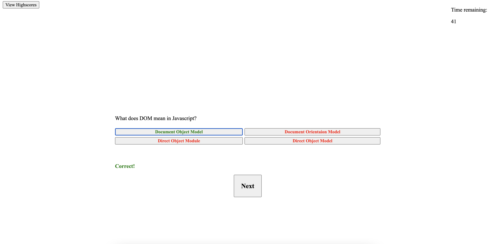

Attached is my javascript quiz.

The quiz has a timer on the top right that doubles as the score. When a correct answer is chosen, the timer keeps ticking down as normal. When an incorrect value is chosen, time is deducted from the timer. Once the last question is answered, or if the timer runs out, the game will end and the final score will be displayed. A field to input a name for the highscores list will appear as well.

To view the highscores list, simply click on the highscores button on the top left of the page. Here you can compare your scores to your peers!

Below is a screenshot of the quiz as well as a link leading to it.

https://michael-ishmail.github.io/Challenge-4/

